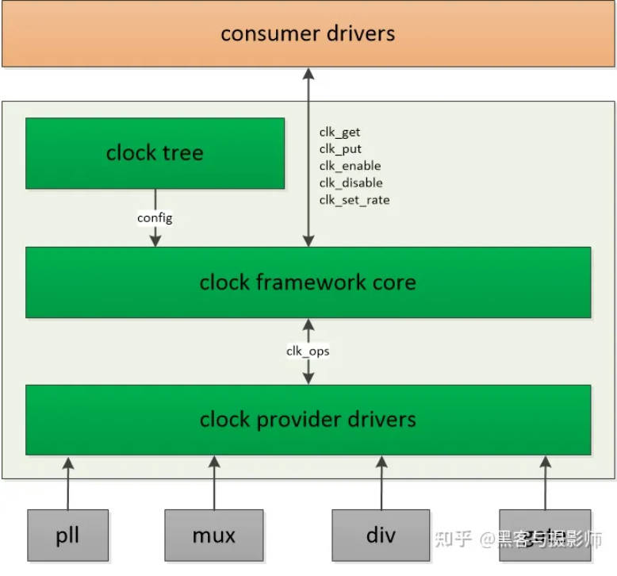

子系统
===========

1 系统原理
------------

linux时钟体系由三部分构成 ``common clock framework``, ``clock provider``, ``clock consumer``

1.1 common clock framework
****************************

1.2 clock provider
*********************

根据时钟特点, ccf将时钟抽象为 ``fixed rate``, ``gate``, ``devider``, ``mux``, ``fixed factor``, ``composite`` 六类
使用数据结构clk_hw来描述

.. code-block::

    struct clk_hw {
        struct clk_core *core;
        struct clk *clk;
        const struct clk_init_data *init;
    };

    # fixed rate表示
    struct clk_fixed_rate {
        struct		clk_hw hw;
        unsigned long	fixed_rate;
        unsigned long	fixed_accuracy;
    };

    # gate表示
    struct clk_gate {
        struct clk_hw hw;
        void __iomem	*reg;
        u8		bit_idx;
        u8		flags;
        spinlock_t	*lock;
    };

    ···
    

2.3 clock consumer
*********************

2 系统流程
------------

============================================= =======================================
重要文件                                      说明
kernel/include/dt-bindings/clock/xxx-clock.h  关于时钟ID定义的头文件, 设备树中会引用
============================================= =======================================
